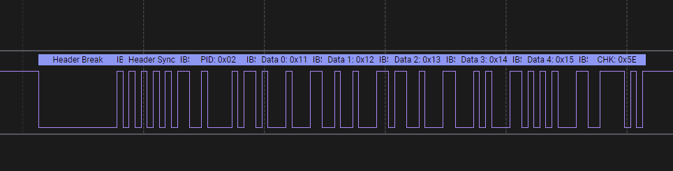

### 01. toggle_led
 - LED(GPIOB.14)와 LED(GPIOB.15) 토글

### 02. button_led
 - SW4(GPIOB.12) 를 누르면 LED(GPIOB.14) 점등, 떼면 소등
 - SW5(GPIOB.13) 를 누르면 LED(GPIOB.15) 점등, 떼면 소등

### 03. uart1_printf
 - RS232 포트(UART1) 에서 Hello World -  출력

### 04. rs485_send
 - RS485 포트(UART3) 에서 Hello World 출력 
 - 테스트를 위해 RS485 to USB 와 같은 동글 필요!

### 05. rs485_recv
 - RS485 포트(UART3) 로 RS485 수신
 - 수신된 데이터는 문자열 형태로 RS232(UART1) 포트로 출력
 - 테스트를 위해 RS485 to USB 와 같은 동글 필요!

### 06. can_tx
 - CAN 송신 
 - SW4(GPIOB.12)를 누르고 땔 때 CAN 데이터 전송
 - ID 123, DLC 8, DATA 01, 02, 03, 04, 05, 06, 07, [버튼상태, 01 또는 00]

### 07. can_rx 
 - CAN 수신
 - 수신된 데이터는 문자열 형태로 RS232(UART1) 포트로 출력
 - 테스트를 위해 CAN to USB나 CAN_TX 예제를 돌릴 수 있는 보드가 하나 더 필요!

### 50. lin_bus_master_send
 - LIN 트랜시버 모듈 필요
 - UART2(PA2, PA3)
 - EN Pin(PA5), Active High
 - SW4(PB12)를 누르면 PID 0x02, 데이터 0x11, 0x12, 0x13, 0x14, 0x15 송신
   

 